In this setup, the program processes transactions and floor price updates from single files and writes output using streams. For real-world applications, this approach would not scale for real-time, high-volume data streams. Instead, the system would handle continuous streams of events. It would use in-memory caches for quick access and databases for storing data long-term. This ensures efficient processing, real-time updates, and scalability under heavy data loads.

## Summary of runtime and memory complexity

1. Reading, Merging, Sorting, and Grouping Data:
   - Runtime: $O((n + m) \log(n + m))$
     - Reading Input Data: $O(n + m)$
     - Merging and Sorting Data: $O((n + m) \log(n + m))$
     - Grouping Data: $O(n + m)$
   - Memory: $O(n + m)$

2. Processing Data:
   - Runtime: $O(n + m)$
     - Processing Each Item: $O(1)$ per item, with map/set operations being amortized $O(1)$
   - Memory: $O(p + q + r)$ for maps and sets used (distinct NFTs, collections, and wallets)

3. Writing Output:
   - Runtime: $O(w)$ where $w$ is the number of wallets processed for feed
   - Memory: $O(1)$

### Overall complexity:
- Runtime: $O((n + m) \log(n + m))$
- Memory: $O(n + m + p + q + r)$

Here, $n$ is the number of transactions, $m$ is the number of floor price items, $p$ is the number of distinct NFTs, $q$ is the number of collections, and $r$ is the number of wallets.

This program efficiently processes and merges large sets of transaction and floor price data, with performance primarily determined by the number of data items. While it is designed to handle large volumes of data, it may struggle or crash if the number of distinct NFTs, collections, or wallets (i.e. $p$, $q$, or $r$) **exceeds available memory limits.**

## Architecture of the system

#### Pipeline
- Data Ingestion:
  - Use a message queue (e.g., Kafka, RabbitMQ) to decouple ingestion from processing.
  - Implement retries and dead-letter queues for failures.
- Data Processing:
  - Deploy Node.js microservices
  - Use Node.js streaming frameworks (e.g., Kafka Streams).
#### Databases
- Input transactions:
  PostgreSQL or MySQL for transactions.
  Replication and clustering for high availability.
- Floor Prices and Collections:
  - MongoDB for scalable NoSQL storage.
- Caches:
  - Redis for caching.

## Storing and querying P&L data

#### Instantaneous realized/unrealized P&L
Use a relational database (e.g., PostgreSQL) to store the latest P&L for each user.
Use an in-memory data store (e.g., Redis) to cache the latest P&L for fast access.
Query Redis first for the latest P&L. If not found, fallback to the relational database.

### Historical P&L
Use PostgreSQL to store historical P&L snapshots. Create a table with columns for user ID, timestamp, realized P&L, and unrealized P&L.

  - Past 24 hours: Query PostgreSQL with a time-based index to efficiently retrieve fine-grained time intervals.
  - 7 days, 30 days, all-time: Query PostgreSQL with appropriate time intervals (e.g., hourly, daily) using aggregation functions.
Use partitioning and indexing on the timestamp column to optimize query performance.

## Out-of-order updates
To handle out-of-order transactions and price updates while still providing real-time P&L updates, you log each transaction or price update as an event with a timestamp. Process each event as it arrives to update the user's P&L immediately. If an older event arrives later, reprocess the events to correct any inaccuracies. This approach ensures real-time updates and fixes temporary inaccuracies when all data is eventually processed.

